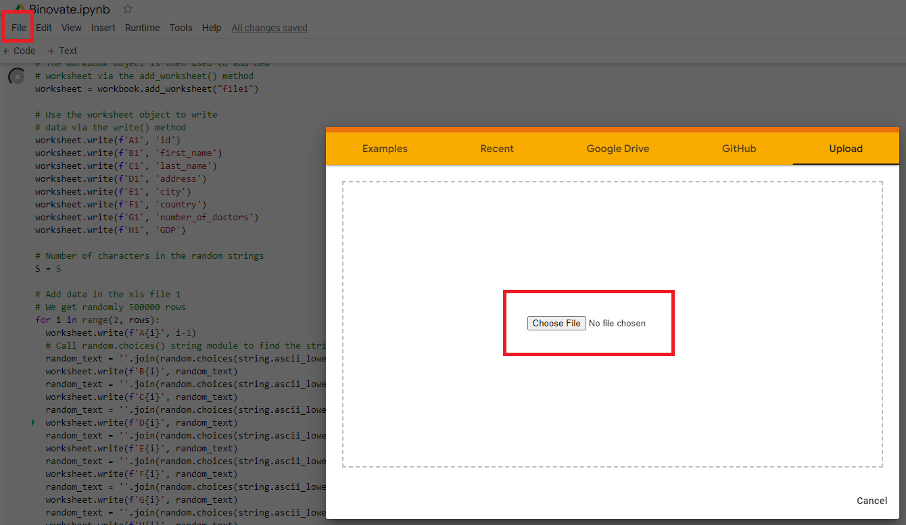
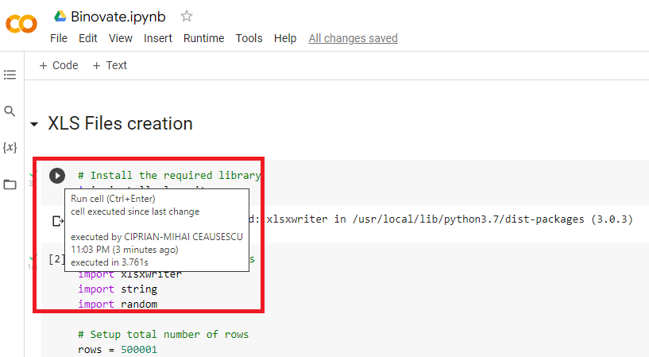
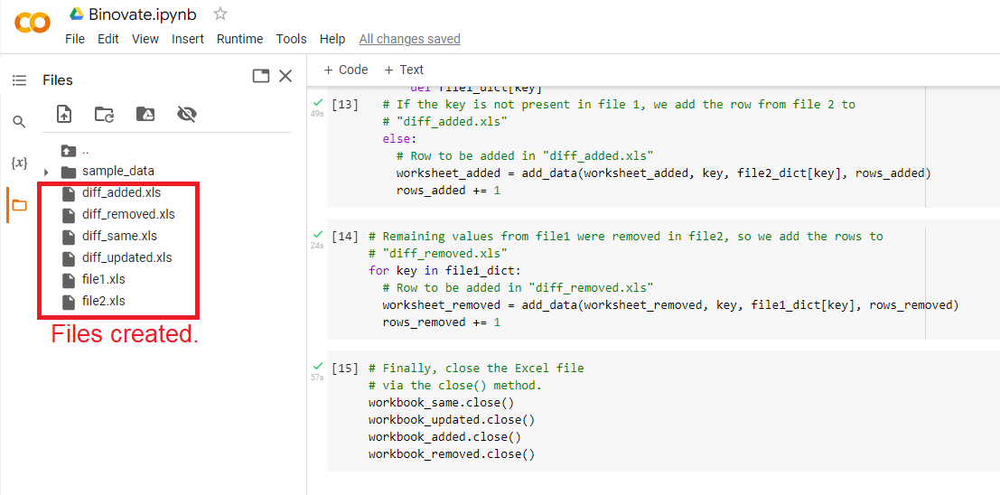

# Binovate
Task description: 
The goal of the assessment is to write a few scripts that will diff two large `XLS files`. We will need to write a script to generate two files:
1. <b>file1.xls</b> - generate a file with 500k-1M rows that has 8 columns (id - this is a string, first_name, last_name, address, city, country, number_of_doctors, GDP). The values are random values (they do not have to be actual addresses and gdps).
2. <b>file2.xls</b> - the second file is a subset of the initial file, but we need to remove some rows, add some extra rows, and update some of the existing row (except the ID).

Given the two files we need to write another script that will diff the two files and output 4 `XLS files`: 
1. <b>diff_added.xls</b> - containes all the rows that have been added (a row is added if the id is not found in file1.xls but found in file2.xls
2. <b>diff_removed.xls</b> - containes all the rows that have been deleted (the ids are in file1.xls but not found in file2.xls)
3. <b>diff_updated.xls</b> - containes all the rows that have been updated (the ids are in both file1.xls and file2.xls but the values of the columns are different)
4. <b>diff_same.xls</b> - contains all the rows that are the same (the ids are in both file1.xls and file2.xls and the values are the same)

## How to run the project?
1. The project was run using [Google Colab](https://colab.research.google.com/);
2. Clone the [current repository](https://github.com/cciprianmihai/Binovate);
3. Open the Google Colab and upload the "Binovate.ipynb" file in Colab (click on file button, upload, then select the "Binovate.ipynb" from your local folder):

5. Run each cell in the uploaded code by clicking the `run` cell button or by pressing `ctlr+enter`:

6. After each cell is ran, we can check the final `xls` files, under Colab files:

## Why is the solution efficient?
First of all, I take all the data using `pandas data frames` and I convert them into 2 dictionaries where:
- the `key` is the `id`;
- the `value` is created by concatenating all the columns together with a hashtag between them. 

Then, I take all the `keys` from dictionary 2, which is file 2. I check if this `key` from file 2 is present in file 1 dictionary.

- If the `key` from file 2 is present in file 1, then:
  - The `values` can be equal, which means that I write the whole row (from dictionary 2) with `id` and `columns` in `diff_same`;
  - The `values` can be different, which means that I write the whole row (from dictionary 2) with `id` and `columns` in `diff_updated`;
  **VERY IMPORTANT HERE, AFTER WE HAVE A MATCH ON THE KEYS, I REMOVE THE KEY FROM DICTIONARY 1. BY THE END, IN DICTIONARY 1 I WILL HAVE ONLY THE REMOVED DATA.**
- If the `key` from file 2 is not present in file 1, then:
  - I write the whole row (from dictionary 2) with `id` and `columns` in `diff_added`;

By the end, I take all the remaining keys and values from dictionary 1 and I write the whole rows (from dictionary 1) with `id` and `columns` in `diff_removed`.
